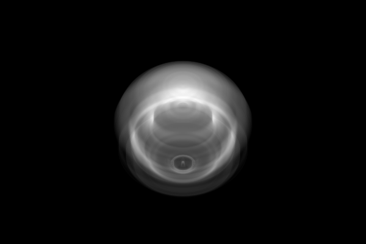

# RadioRT
### Radio continuum and recombination line radiative transfer code.

******************************

####Overview

RadioRT produces synthetic radio continuum and radio recombination line observations of the data snapshots output by TORCH. It uses the scheme by [Dougherty et al. (2003)](#D3)), which integrates intensity, optical depths and emission measures along rays through TORCH grid data to an image plane.

####Example Usage
After building, the directory tree (with `bin` as root directory) of the application should look like this:
```
.
├── radio
├── config
|   └── radio-config.lua
```

To run, execute torch from the `bin` directory. For example:
```bash
./radio
```
By default RadioRT reads in the configuration files, `config/radio-config.lua`.
You can specify your own configuration file:
```bash
./radio --config=/path/to/radio-config.lua
```  
The `-s` flag can also be passed to run the program silently (only error messages will appear on the console).  

#####Setup

For example, to produce a synthetic radio continuum map of `example-data.txt`, which was itself produced by TORCH using the parameters in `torch-config.lua`, the parameters could be:

```lua
-- config/radio-config.lua

Parameters = {
	torch_params_filename =      "config/torch-config.lua",
	torch_data_filename =        "config/example-data.txt",
	output_directory =           "tmp",

	sampling =                   4.0,
	dopplerShifted =             false,
	dopp_shift_phi_inc =         0.01,

	distance =                   1.5,
	right_ascension =            308.94617775,
	declination =                41.379058775,
	theta =                      45.0,
	phi =                        0.0,

	frequency =                  5.0e9,
	bandwidth =                  0,
	nchannels =                  1,
	nlevel =                     0,
	stokes =                     1,

	turb_broadening =            1.0e6,
	vLOS =                       0,

	integratingFF =              true,
	integratingRL =              false,
	resolution_scale =           2,
}
```

#####Output
The files `emeasure_ff.fits`, `intensity_pixel_ff.fits`, and `odepth_ff.fits` are created in the directory assigned to `output_directory` and contain the emission measure, intensity and optical depth maps of the data in the FITS format.

This image of the intensity map was exported from ds9:



####Compiling

RadioRT uses the cmake build process. To build simply make a `build` directory and call `ccmake` from there:
```bash
mkdir build
cd mkdir
ccmake path/to/RadioRT
make
```

To specify your C++ compiler (RadioRT requires gcc 4.7.2+) you need to set some environment variables before calling `ccmake`:
```bash
export CC=/path/to/gcc
export CXX=/path/to/g++
```

####Advanced Usage
| Parameter                     | Notes                                     |
| :---------------------------- | :---------------------------------------- |
| `torch_params_filename`   | Filename of TORCH config file with the parameters used to run the simulation of the input data. |
| `torch_data_filename`     | Filename of the input data (output data of TORCH). |
| `output_directory`        | The output directory. |
| `sampling`                | Number of integration steps per cell width along a ray. |
| `dopplerShifted`          | Include doppler shifting of lines? |
| `dopp_shift_phi_inc`      | Increment in azimuthal angle (in degrees) when calculating doppler shifts across cell in a cylindrical grid. |
| `distance`                | Distance to source (units of kpc). |
| `right_ascension`         | Right ascension of source. |
| `declination`             | Declination of source. |
| `theta`                   | Angle, in degrees, of line of sight to the z-axis of the model grid (theta = 0 is the N-pole and theta = 90 is in the equitorial plane). |
| `phi`                     | Angle of projected line of sight on the x-y plane to the x-axis of the model grid (phi = 0 is viewing along x-axis). |
| `frequency`               | Observing frequency in Hertz. |
| `bandwidth`               | Oberving bandwidth in Hertz. |
| `nchannels`               | Number of frequency bins observed. |
| `nlevel`                  | Final level number of the recombination line. |
| `stokes`                  | Stokes parameter. |
| `turb_broadening`         | Turbulent broadening of line. |
| `vLOS`                    | Line of sight velocity of source. |
| `integratingFF`           | Integrate radio continuum intensity? |
| `integratingRL`           | Integrate radio recombination line intensity? |
| `resolution_scale`        | The resolution scale of the image grid wrt to the model grid. |

### Goals 
* Incorporate RRL_Departure code.

####Developer info
Harrison Steggles, University of Leeds (PhD student).

####References
<a name="D3"></a>Dougherty, S. M., Pittard, J. M., Kasian, L., Coker, R. F., Williams, P. M., and Lloyd, H. M. (2003). Radio emission models of colliding-wind binary systems. A&A, 409:217–233 ([link](http://www.aanda.org/articles/aa/pdf/2003/37/aa3896.pdf))  

####Requirements
* gcc 4.7.2+.
* [cfitsio](https://github.com/healpy/cfitsio): "A library of ANSI C routines for reading and writing FITS format data files".
* [Selene](https://github.com/jeremyong/Selene): "Simple C++11 friendly header-only bindings to Lua 5.2+".  
* [Lua5.2+](http://www.lua.org/): "A powerful, fast, lightweight, embeddable scripting language".  
